# ibebe Oficial eCommerce

Este proyecto consiste en una página web eCommerce conectada a una APIRestFul backend con Base de Datos para la gestión y utlización de una tienda online de un negocio de Instagram 'iBebeOficial'.

### Instalación:
* Clonar el repositorio: git clone https://github.com/jordijerico/FrontendProyectoFinal
* Instalar las dependencias: npm install
* Iniciar el servidor de desarrollo: npm run dev

### Descripción breve de cómo usar la web.

Navegar a la url en el navegador.

* Si no dispone de cuenta: Hacer clic en el botón "Registrarse".
* Hacer clic en el botón "Iniciar sesión".
* Introducir las credenciales de usuario.
* Ver todos los productos
* Ver producto en detalle
* Añadir producto al carrito
* Ver Carrito de la compra
* Ver tu información de perfil
* Modificar tu información de perfil
* Ver historial pedidos

### Características e imágenes

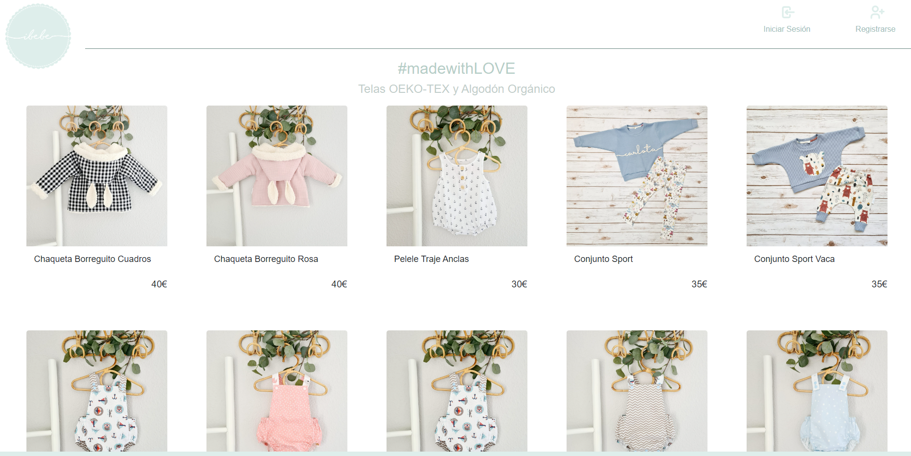

1. Registro de clientes en la aplicación
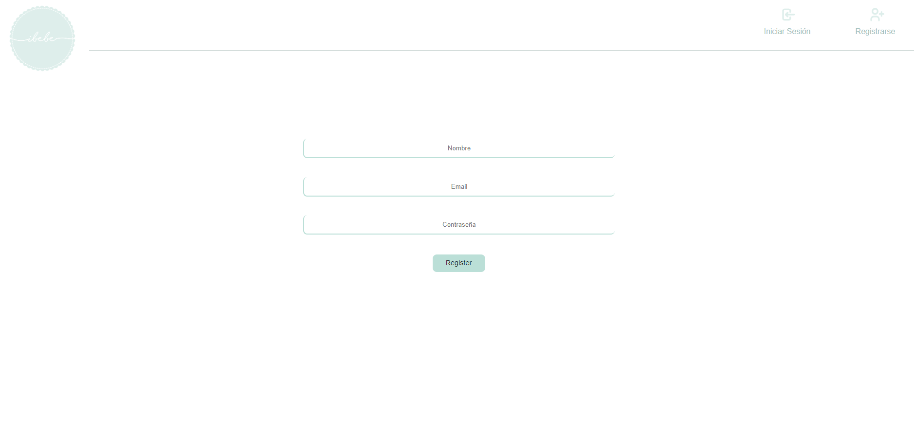
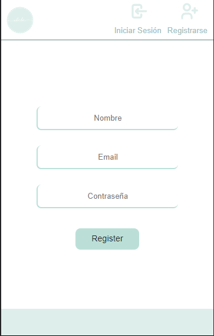
2. Login de usuarios en la aplicación como doctor/cliente/admin
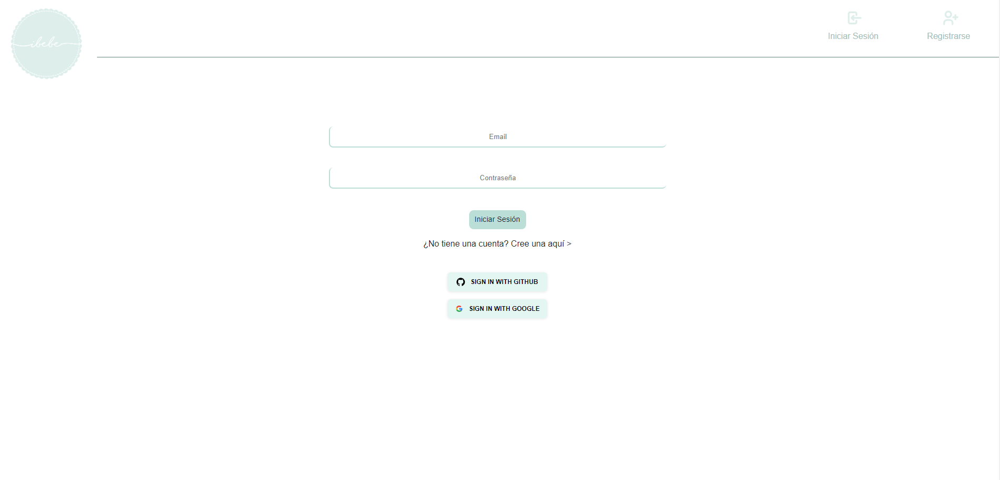
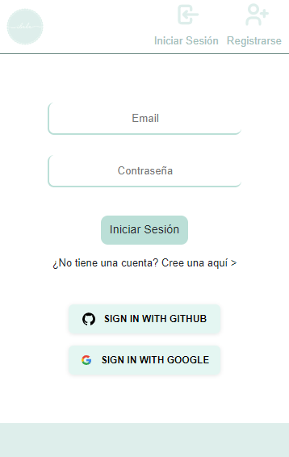
3. Consulta de datos del perfil
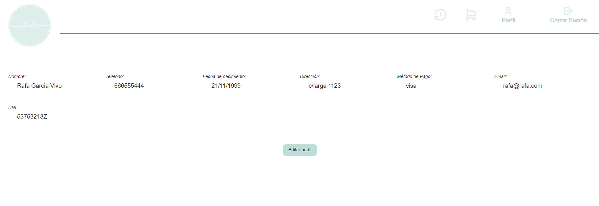
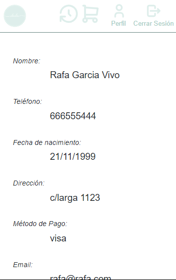
4. Modificación datos perfil
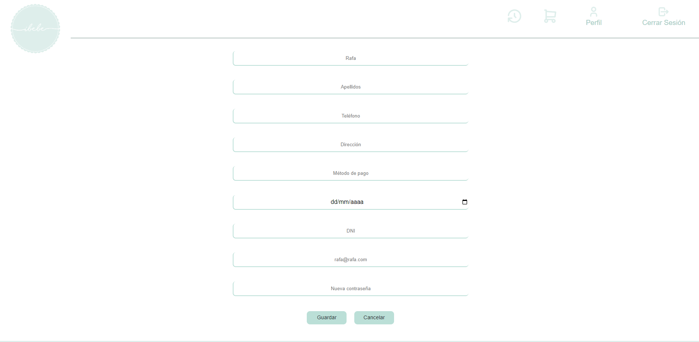
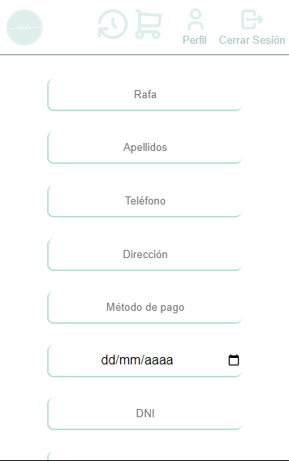
5. Producto en detalle
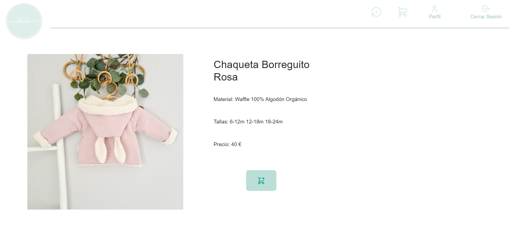
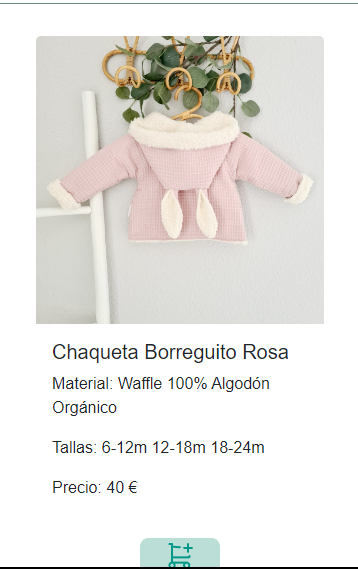
6. Historial de pedidos
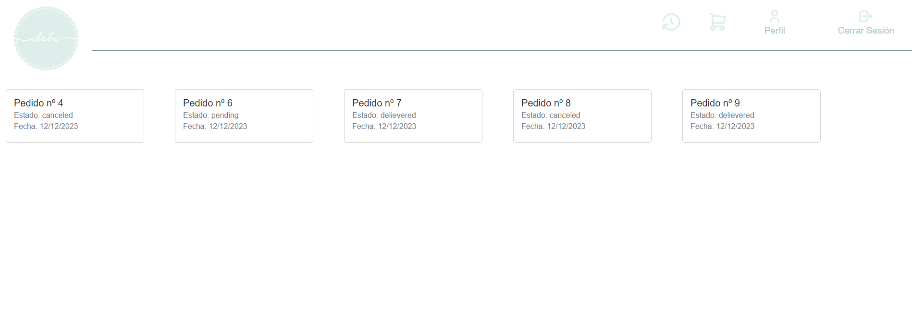
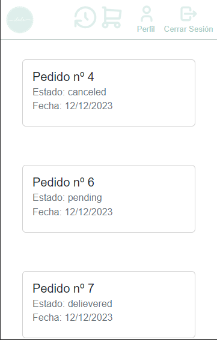

### Tecnologías utilizadas
* React
* HTML
* CSS
* JavaScript

### Contribución
Si deseas contribuir a este proyecto, sigue los siguientes pasos:

1. Haz un fork del repositorio.
2. Crea una rama con tus cambios: git checkout -b mi-rama.
3. Haz tus cambios y haz commit: git commit -m "mis cambios".
4. Haz push a la rama: git push origin mi-rama.
5. Crea un pull request en el repositorio original.
### Créditos
Autor: Jordi Jericó López
Contacto: jordijerico@gmail.com   

   

  

### Licencia
Este proyecto está bajo la licencia MIT. Consulta el archivo LICENSE para más detalles.
